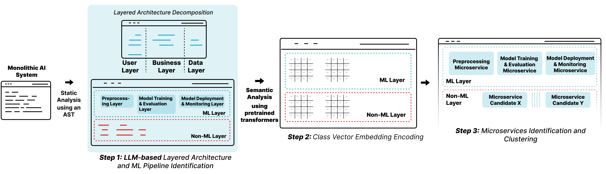

# Decomposing ML-Based Monolithic Systems into Microservices Using LLMs and ML-Aware Architectural Patterns

This repository accompanies the research paper:  
**"A Pattern-Driven and LLM-Assisted Approach for Decomposing Monolithic ML-Based Systems into Microservices."**  
It includes the implementation code, embedding generation scripts, clustering analysis, and results related to our proposed decomposition pipeline.

---

## 🎯 Paper Objective

The goal of this research is to provide an automated and ML-aware approach for decomposing monolithic systems into microservices. Recognizing the complexity of ML workflows embedded in traditional monoliths, we leverage architectural design patterns specific to ML pipelines and harness the capabilities of Large Language Models (LLMs) and semantic embeddings to identify, segment, and restructure ML components as standalone microservices.

---

## ⚙️ Methodology Overview

Our methodology consists of three structured phases:
  

### 1. LLM-Based Layered Architecture and ML Pipeline Identification

We perform a two-dimensional structural decomposition of the monolithic codebase using LLMs and architectural patterns:

- *Vertical decomposition*: Distinguishes ML-specific components from non-ML ones.
- *Horizontal decomposition*: Classifies classes into layers such as User Interface, Business Logic, and Data Access.
- ML-related classes are further categorized into core pipeline stages: data preprocessing, model training, evaluation, and deployment.

---

### 2. Class Vector Embedding Representation

Identified classes are transformed into high-dimensional semantic embeddings using **CodeBERT**, capturing both syntax and contextual semantics of the source code. This results in a rich embedding matrix informed by both code structure and architectural classification.

---

### 3. Clustering and Microservice Candidate Identification

We apply **HDBSCAN**, a density-based clustering algorithm, to group similar classes. Each cluster represents a potential microservice. Clusters are validated using ML architectural principles to ensure they map logically to functional modules.

---

## 🧪 Case Study Description

Our method was evaluated on two ML-based monolithic systems:

- **Asparagus**: An open-source Python-based application that includes ML-driven decision logic.
- **Stock and News Prediction System**: A proprietary system combining C# and Python components to predict market trends based on financial news.

Each system contains diverse components such as data processing modules, predictive models, and supporting infrastructure, providing realistic evaluation scenarios for our decomposition pipeline.

---

## 📊 Evaluation

To ensure robust validation:

- **Ground Truth Construction**: Two expert developers manually analyzed and annotated both systems, iterating over several review rounds to reach a consensus on ML component boundaries and their microservice suitability.
- **Evaluation Metrics**:
  - *Classification Accuracy*: Measures how effectively the LLM categorized each class into the correct architectural layer or ML pipeline stage.
  - *Structural Quality*: Assesses cohesion, coupling, and boundary clarity in the resulting microservice clusters.

The results confirm that our method reliably isolates ML components and produces modular decompositions aligned with the logical boundaries of ML workflows.

---

## ✅ Conclusion

This work demonstrates a novel and effective strategy for decomposing ML-centric monolithic systems into microservices. By combining LLM-based architectural analysis, semantic code embeddings, and unsupervised clustering:

- ML pipeline components are correctly identified and modularized.
- The decomposition supports system scalability, fault isolation, and maintainability.
- The resulting architecture aligns with ML-specific design patterns, easing operational and lifecycle management.

---

## 📁 Repository Structure

- `data/`: Example monolithic source code and extracted embeddings  
- `notebooks/`: Interactive Jupyter notebooks to reproduce experiments
